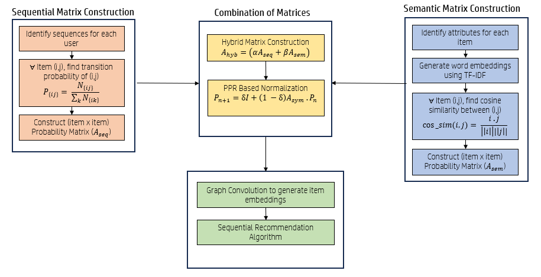
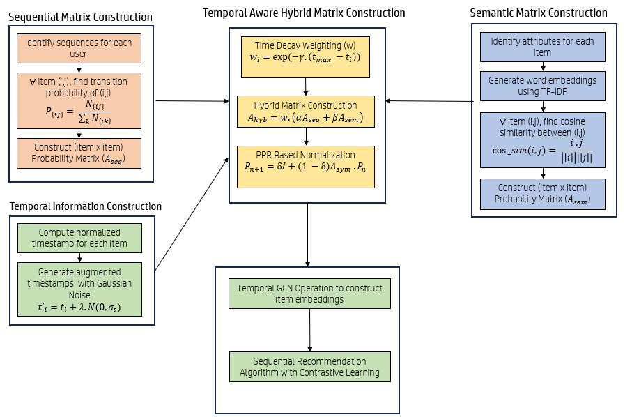

# MCP-and-TMCP-SASRec
The code repository for the paper "Optimizing Sequential Recommendation with Enhanced Graph
Convolution-Based Semantic and Sequential Hybrid Relations"

## Overview
Recommendation systems play a crucial role in industries such as e-commerce, education and entertainment, offering personalized and intelligent suggestions based on a user’s preferences. Sequential recommendation systems take into account a series of a user’s historical actions to predict the next interaction. Existing sequential recommendation systems primarily rely on sequential item relations without effectively integrating the semantic and temporal relations between items. This paper introduces MCP\_SASRec and its temporal variant TMCP\_SASRec, two novel frameworks for sequential recommendation to construct a sequentially, semantically and temporally rich hybrid matrix utilizing \textbf{M}arkov State Transition probabilities, \textbf{C}osine similarity, \textbf{P}ersonalized PageRank(PPR) based normalization and \textbf{T}emporal information. The constructed hybrid matrix is smoothened using a graph convolution (GCN) operation to generate item embeddings that can be passed to the transformer-based sequential recommendation model SASRec for next-item prediction. Experimental results show that MCP\_SASRec and TMCP\_SASRec outperform the state-of-the-art-models achieving 2-10\% improvement in evaluation metrics like Hit Ratio (HR), Normalized Discounted Cumulative Gain(NDCG) and Mean Reciprocal Rank(MRR), showcasing its effectiveness and utility.

Proposed MCP framework with Markov State Transition probabilities, Cosine Similarity and PPR-based normalization

Proposed TMCP framework with additional time decay weighting and temporal GCN operations

## Datasets
All datasets utilized are publically available on kaggle:

- [MovieLens-1M](https://www.kaggle.com/datasets/shikharg97/movielens-1m)
- [Yelp](https://www.kaggle.com/datasets/yelp-dataset/yelp-dataset)
- [Amazon Beauty](https://www.kaggle.com/datasets/smritimadangarli/amazon-beauty/data)

## Requirements
- Python version: 3.10.12 
- NumPy version: 1.26.4
- Pandas version: 2.2.3
- PyTorch version: 2.5.1+cu121
- Scikit-learn version: 1.2.2

## Running the Code
The code was tested on Kaggle using the GPU T4x2 accelerator. To replicate this setup, you can either configure a similar environment locally or upload the provided notebooks to Kaggle and run them there by modifying the dataset and associated files accordingly.
